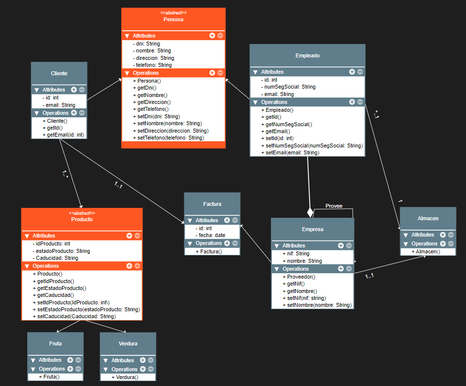

# Elaborar un diagrama de clases UML de cosecha propia

## Marc Morlá Isern

### Enunciado:
    -Enunciado del ejercicio.
    -Imagen con la solución del ejercicio. (programa a elegir)
    -Si  el ejercicio  se inspira en una página web o bibliografía, debe añadirlo.
    -Debes entregar todo lo que se requiere en un repositorio de github en el que deberéis hacer colaborador.
    -El repositorio debe contener el enunciado, la solución y si se ha conseguido, el código fuente.

### Ejercicio (Parte A): 

Se nos a propuesto llevar un registro de una fruteria donde se quiere guardar la información esencial sobre las personas, que pueden ser tanto clientes como empleados. Ademas se quiere llevar un conteo de todos los productos que haya en los almacenes. El almacen tiene que estar supervisado por un empleado. Por ultimo queremos guardar todas las facturas de los pedidos.
    
Ejercicio resuelto: 
